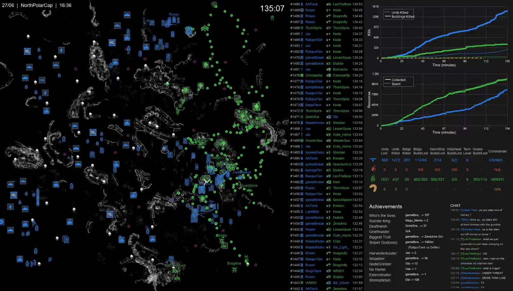

# MapReplay Live Service

Real-time game replay generation for Silica Dedicated Server. 
Requirement! Databomb's logging mod needs to be installed, thus the game replays are fetched from the generated logs (see https://github.com/data-bomb/Silica).
Logs are fetched from ..\Silica Dedicated Server\Userdata\logs



*Sample output frame from a finished round on NorthPolarCap. From left to right: live map view with every unit / building / kill marker; a per-kill scrolling killbar; cumulative kills + resources graphs; per-team stats table; achievements; and the full chat panel. Together they reconstruct a complete spectator view of the match.*

## Overview

This service monitors the game server log files and automatically generates map replay videos as games are being played. It runs in the background with minimal CPU impact on the game server.

## Features

- **Real-time Processing**: Generates replay frames as events occur in the game
- **CPU Affinity Control**: Avoids using the game server's primary CPU core
- **Midnight Rollover Handling**: Seamlessly handles log file changes at midnight
- **Automatic Game Detection**: Detects game start/end events automatically
- **Low Priority Processing**: Runs at below-normal priority to avoid impacting gameplay
- **Auto Python Detection**: Automatically finds your Python installation on first run
- **Discord Integration**: Optional automatic upload of replays to Discord via webhook

## Directory Structure

```
Silica Dedicated Server/
+-- Mod MapReplay/
|   +-- MapReplay_Service.py         # Main service script
|   +-- Log_Emulator.py              # Testing tool - replays historical logs
|   +-- Start_MapReplay_Service.bat  # Easy launcher (auto-detects Python)
|   +-- Run_Emulator.bat             # Easy emulator launcher
|   +-- live_config.py               # Live service configuration
|   +-- extract_game_assets.py       # Re-extract assets from game files after updates (developer tool)
|   +-- pack_assets.py               # Asset packer (developer tool)
|   +-- assets.pak                   # Packed game assets (maps + icons)
|   +-- modules/                     # Core modules
|   |   +-- config.py
|   |   +-- renderer.py
|   |   +-- log_parser.py
|   |   +-- statistics.py
|   |   +-- data_models.py
|   |   +-- icon_config.py
|   |   +-- asset_loader.py          # Loads assets from .pak file
|   |   +-- map_loader.py            # Map image loading helper
|   +-- Replays/                     # Generated replay videos
+-- UserData/
|   +-- logs/                        # Game log files (L20251214.log)
```

## Installation

1. **Copy Files**: Copy the entire `Mod MapReplay` folder to your Silica Dedicated Server directory.

2. **Run the Launcher**: Double-click `Start_MapReplay_Service.bat`.
   - On first run, it will **automatically search** for your Python installation.
   - If Python is found, confirm with `Y` and the path is saved.
   - If not found automatically, you can enter the path manually.
   - Required packages (Pillow, numpy, imageio, etc.) are installed automatically.

3. **Configure** (optional): Edit `live_config.py` for CPU affinity, game filtering, and Discord webhook settings.

That's it. The game assets (maps and icons) are included in `assets.pak` and loaded automatically.

## Usage

### Manual Start (Recommended for Testing)

Double-click `Start_MapReplay_Service.bat` or run:
```batch
python MapReplay_Service.py
```

Press `Ctrl+C` to stop.

### Command Line Options

```
python MapReplay_Service.py [options]

Options:
  --server-root PATH    Path to Silica Dedicated Server root
  --avoid-cores 0,1     CPU cores to avoid (comma-separated)
  --debug               Enable debug logging
```

---

## Testing with Log Emulator

The **Log Emulator** allows you to test the MapReplay Live service using historical log files. It replays logs at configurable speeds, simulating a live game server.

### Quick Start

1. **Drag & Drop**: Drag a log file onto `Run_Emulator.bat`

2. **Or Command Line**:
   ```batch
   python Log_Emulator.py path/to/L20251214.log --speed 30
   ```
   If there a troubles with emulator, try to delete the newest log file located in "..\Silica Dedicated Server\Userdata\logs" and try again

### Emulator Options

```
python Log_Emulator.py <input_log> [options]

Options:
  --speed, -s SPEED     Playback speed multiplier (default: 10)
  --output-dir, -o DIR  Output directory (default: ../UserData/logs/)
  --start-line, -l NUM  Start from specific line number
  --select-game, -g     Interactive game selection menu
  --clear-output, -c    Clear existing output log before starting
```

### Speed Examples

| Speed | 1 hour of game = | Use case |
|-------|------------------|----------|
| 1x    | 1 hour           | Real-time testing |
| 10x   | 6 minutes        | Quick testing (default) |
| 30x   | 2 minutes        | Fast testing |
| 60x   | 1 minute         | Very fast testing |
| 100x  | 36 seconds       | Rapid iteration |

### Interactive Controls (During Playback)

| Key | Action |
|-----|--------|
| `+` or `=` | Increase speed (1.5x) |
| `-` | Decrease speed |
| `p` | Pause / Resume |
| `s` | Show status |
| `q` | Quit |

### Testing Workflow

1. **Start the Emulator** (in one terminal):
   ```batch
   python Log_Emulator.py historical_game.log --speed 30 --select-game --clear-output
   ```

2. **Start MapReplay_Live** (in another terminal):
   ```batch
   python MapReplay_Service.py --debug
   ```

3. **Watch** as the service detects games and generates replays

4. **Check** the `Replays/` folder for generated videos

---

## Configuration

### CPU Affinity (`live_config.py`)

```python
# Avoid core 0 (typically used by game server)
AVOID_CORES = [0]

# For multi-core servers, you might want:
AVOID_CORES = [0, 1]  # Avoid first two cores
```

### Game Filtering

```python
# Only process specific game types
GAMETYPE_FILTER = ["HUMANS_VS_HUMANS_VS_ALIENS"]

# Process all game types
GAMETYPE_FILTER = []
```

### Video Settings

Video quality settings are in `modules/config.py`:
- `VIDEO_RESOLUTION`: "720p", "1080p", "1440p", "4k"
- `VIDEO_FPS`: Frames per second (default: 45)
- `FRAME_STEP`: Sample every N seconds (default: 1)

### Discord Webhook (`live_config.py`)

```python
DISCORD_WEBHOOK_ENABLED = True
DISCORD_WEBHOOK_URL = "https://discord.com/api/webhooks/your_webhook_url_here"
```

## Output

Replays are saved to `Replays/` folder with format:
```
2025-12-14_223047_GreatErg_HvH.mp4
```

## Troubleshooting

### Service Won't Start

1. Run `Start_MapReplay_Service.bat` — it handles Python detection and package installation automatically.
2. Check `mapreplay_service.log` for errors.
3. If Python detection fails, enter the path manually when prompted (run `where python` in Command Prompt to find it).

### No Replays Generated

1. Verify log files exist in `UserData/logs/`
2. Ensure games meet minimum duration (default: 10 minutes)
3. Check `mapreplay_service.log` for "Map image not found" errors

### High CPU Usage

1. Increase `POLL_INTERVAL` in `live_config.py`
2. Add more cores to `AVOID_CORES`
3. Reduce `VIDEO_RESOLUTION` in `modules/config.py`

## Log Files

- `mapreplay_service.log` - Service log (in Mod MapReplay folder)
- Console output when running manually

## Performance Notes

- The service uses approximately 5-15% of one CPU core during active games
- Memory usage is typically 200-500 MB depending on video resolution
- Disk writes are buffered to minimize I/O impact

## Asset Pack System

Game assets (map images and unit icons) are stored in `assets.pak`, a compressed binary file. This keeps game assets from being directly browsable while allowing the mod to load them at runtime.

### Updating assets after a game update (developer)

When Silica updates and adds new maps or changes icons, run `extract_game_assets.py` to re-extract assets directly from the game files and rebuild `assets.pak`:

```batch
pip install UnityPy Pillow
python extract_game_assets.py
```

This reads from the game client's `sharedassets0.assets` file via UnityPy — no manual AssetRipper step needed. The script:
1. Auto-detects the Silica install location (or pass `--game-dir "D:/Silica"`)
2. Extracts all map textures and `Tac_*` unit icons
3. Computes correct world extents from terrain data
4. Rebuilds `assets.pak` ready for deployment

Options:
```
python extract_game_assets.py                          # extract + rebuild assets.pak (default)
python extract_game_assets.py --extract-only           # extract PNGs to Assets/ folder only
python extract_game_assets.py --pak-only               # rebuild assets.pak from existing Assets/
python extract_game_assets.py --game-dir "D:/Silica"   # custom game install path
```

After running, copy the updated `assets.pak` to the server's `Mod MapReplay/` folder.

The mod falls back to loading from the raw `Assets/` folder if `assets.pak` is not found, which is useful during development.

## License

This project is licensed under the MIT License. See [LICENSE](LICENSE) for details.

**Asset Notice**: The map images and unit icons included in `assets.pak` are from the game **Silica** by Bohemia Interactive. These assets are their intellectual property and may not be extracted, redistributed, or used outside of this mod. This is an unofficial community tool, not affiliated with or endorsed by Bohemia Interactive.
